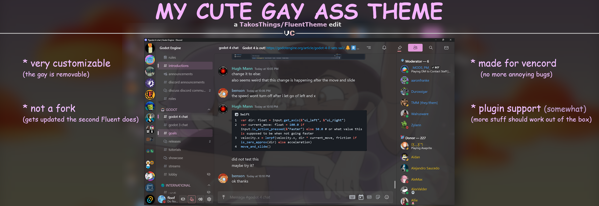

Some changes I've made to [TakosThings' FluentDiscord theme.](https://github.com/TakosThings/Fluent-Discord)

***Currently broken due to Discord's update, almost all themes are!***

# Configuration (Vencord/BD)
If you want to replace my hella gay Owl House wallpaper _(dont know why you'd do that)_ use the following:
```css
@import url(https://raw.githubusercontent.com/FlooferLand/DiscordFluentTheme/main/fluent.theme.css);

:root {
	/* OrchidLight */
	--fluent-accent-hue-sat: 307, 55%;
	--fluent-accent-lightness: 49%;

	/* The colour text appears against the accent colour */
	--fluent-text-on-accent-color: 0, 0, 0;

	/* Ignore the gay */
	--fluent-acrylic-background: url(https://images2.alphacoders.com/129/1291151.png);
	--fluent-acrylic-background-blur: 2px;
	--fluent-acrylic-background-dimness: 60%;
	--fluent-acrylic-background-saturate: 50%;
	--fluent-guilds-icon-size: 40px;
}
```
### In Vencord, just paste that into your QuickCSS page. Could probably do the same for BD
Also view all the settings [here](https://github.com/TakosThings/Fluent-Discord/wiki/Options) alright goodbye thank you ヾ(＠⌒ー⌒＠)ノ

# Keep in mind
- This is an edit of FluentDiscord, that theme belongs to [TakosThings.](https://github.com/TakosThings)
  I haven't made most of the theme, but I've made some custom elements to improve it
- My theme is built on top of FluentDiscord using a CSS `@import`, when it receives any updates, so will this theme
- This theme is mainly built for Vencord, i havent tested it on BD
- Some things might be inconsistent, feel free to [open up an issue.](../../issues/new)
  I currently daily-drive this theme however, so anything thats too annoying will definitely get patched

# Plugin support
Currently, I've made an effort to add support for the following Vencord plugins:
- ReadAllNotificationsButton

Vencord plugins that aren't listed here should still work, if they don't, please [open up an issue](../../issues/new)
